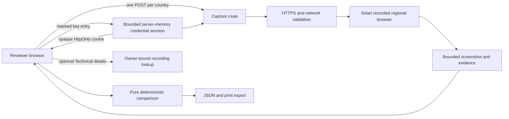

# LocaleLens Execution Index

Status: live-only user-owned-key implementation and owner-accepted live evidence
are on `main`; current submission status and checks are in the
[reviewer handoff](../examples/localelens-web/docs/submission/reviewer-handoff.md).

The phase map and control record below preserve historical checkpoints. Their
sample-mode and authorization statements describe those checkpoints, not the
current runtime or the owner's later publication approvals.

Owner: Billy Tompazis

Challenge repository: `https://github.com/solari-sdk/solari-cookbook/`

Implementation location: `examples/localelens-web/`

This is the controlling index for the LocaleLens build. Each phase begins from an accepted predecessor SHA, ends with a verified terminal SHA, and stops before the next phase. A phase title in a document is not evidence of completion.

## Product in one sentence

LocaleLens is a responsive web application that compares one public HTTPS page across 2 to 15 selected Solari proxy markets in deterministic batches of at most three active captures and presents decision signals, screenshots, normalized differences, and safe run receipts.

## Privacy boundary

- Keep the concept, screenshots, source, and demo private until Phase 5 and explicit owner authorization.
- This checkout retains the official cookbook as `upstream` and Billy's writable fork as `origin`. Phase branches may be pushed only to `origin`; never push to `upstream`.
- A neutral credit request may acknowledge participation without describing the application.
- Never place a Solari API key in Git, client code, build output, screenshots, logs, evidence documents, or a public host.

## Phase map

| Phase | Outcome | Live call budget | Required proof | Terminal stop |
|---|---|---:|---|---|
| 0 — Foundation | Fork-anchored Next.js package, pure contracts, deterministic fixtures, minimal build | 0 | Unit tests, typecheck, lint, build, dependency inspection | No visual implementation or Solari dependency |
| 1 — Visual shell | Owner-selected Product Design direction and complete sample-mode main journey | 0 | Exactly three directions, owner selection, component tests, three viewport reviews | No capture API or provider key |
| 2 — Secure capture | One safe recorded Solari regional capture and replay lookup | ≤3 | SSRF matrix, cleanup tests, server-key inspection, qualified real receipt | No live multi-country orchestration |
| 3 — Live comparison | Independent two/three-country runs, partial success, retry, deterministic comparison, export | ≤4 | Reducer/orchestration tests, bounded live comparison, export safety | No release hardening or public action |
| 4 — Hardening | Accessibility, security, performance, E2E, visual, and live evidence register | ≤4 | Complete local gate, measured client budget, qualified evidence classes | No push, deploy, or post |
| 5 — Submission | Public fork, safe sample deployment, reviewer materials, approved social post | 0 by default | Remote SHA parity, deployment inspection, redaction and owner approvals | No unapproved external mutation |
| Live Product Readiness | Truthful demo/live modes, expanded verified market catalogue, bounded batching, decision-first partial results, and safe UI-to-session attribution | ≤4, only after all non-live gates | Full local gate plus one four-market UI-only run and dashboard correlation | No push, PR, deploy, publish, submit, or release |

## Documents

### Product and technical design

- [`superpowers/specs/2026-09-01-localelens-design.md`](superpowers/specs/2026-09-01-localelens-design.md) — product scope, UX, architecture, contracts, security, evidence, and dependencies.

### Implementation phases

1. [`superpowers/plans/2026-09-01-localelens-phase-0-foundation.md`](superpowers/plans/2026-09-01-localelens-phase-0-foundation.md)
2. [`superpowers/plans/2026-09-01-localelens-phase-1-visual-shell.md`](superpowers/plans/2026-09-01-localelens-phase-1-visual-shell.md)
3. [`superpowers/plans/2026-09-01-localelens-phase-2-secure-capture.md`](superpowers/plans/2026-09-01-localelens-phase-2-secure-capture.md)
4. [`superpowers/plans/2026-09-01-localelens-phase-3-live-comparison.md`](superpowers/plans/2026-09-01-localelens-phase-3-live-comparison.md)
5. [`superpowers/plans/2026-09-01-localelens-phase-4-hardening.md`](superpowers/plans/2026-09-01-localelens-phase-4-hardening.md)
6. [`superpowers/plans/2026-09-01-localelens-phase-5-submission.md`](superpowers/plans/2026-09-01-localelens-phase-5-submission.md)
7. [`superpowers/plans/2026-09-03-localelens-live-product-readiness.md`](superpowers/plans/2026-09-03-localelens-live-product-readiness.md)

### Successor product-readiness design and evidence

- [`superpowers/specs/2026-09-03-localelens-user-owned-solari-keys-live-only-design.md`](superpowers/specs/2026-09-03-localelens-user-owned-solari-keys-live-only-design.md) — current credential and live-only design.
- [`superpowers/plans/2026-09-03-localelens-user-owned-solari-keys-live-only.md`](superpowers/plans/2026-09-03-localelens-user-owned-solari-keys-live-only.md) — implemented successor plan.
- [`../examples/localelens-web/docs/evidence/byok-live-only.md`](../examples/localelens-web/docs/evidence/byok-live-only.md) — qualified live acceptance and cleanup evidence.
- [`../examples/localelens-web/docs/evidence/submission-handoff-2026-09-06.md`](../examples/localelens-web/docs/evidence/submission-handoff-2026-09-06.md) — current submission verification.
- [`superpowers/specs/2026-09-03-localelens-live-product-readiness-design.md`](superpowers/specs/2026-09-03-localelens-live-product-readiness-design.md)
- [`../examples/localelens-web/docs/evidence/live-product-readiness/README.md`](../examples/localelens-web/docs/evidence/live-product-readiness/README.md)
- [`../examples/localelens-web/docs/evidence/live-product-readiness/manual-acceptance.md`](../examples/localelens-web/docs/evidence/live-product-readiness/manual-acceptance.md)

### Start handoff

- [`START_PROMPT.md`](START_PROMPT.md) — copy-ready prompt for Phase 0 after the owner creates the GitHub fork.
- [`PHASE_2_START_PROMPT.md`](PHASE_2_START_PROMPT.md) — copy-ready prompt for the next task after the fork and local planning checkpoint are verified.

## Runtime architecture

There is no database, account system, background worker, queue, WebSocket, LLM, analytics pipeline, or server-side batch job in the MVP.

## Phase control record

Complete this table only with verified Git evidence during execution.

| Phase | Predecessor SHA | Terminal SHA | Verification | Calls used | Owner accepted |
|---|---|---|---|---:|---|
| 0 | `d304843f5ea0edb5c27829bb2ca30868645bef7a` | `53b73806c6205d8181bf19b7fc0f8cd81e7ad18c` | PASS: 19 tests, typecheck, lint, build, dependency inspection | 0 | Yes |
| 1 | `53b73806c6205d8181bf19b7fc0f8cd81e7ad18c` | `6ae07c11d58f2fce27e3cdca84b75578968a04cc` | PASS: 33 tests, typecheck, lint, build, Browser at 360/768/1440 | 0 | Yes |
| 2 | `5691271ce2027ff8e1a61b04a3991ab7e72e088a` | Final Phase 2 branch head (reported after evidence commit) | PASS: 147 tests, typecheck, lint, build, secret inspection, runtime guards, one recorded US capture using Solari's documented residential default with a matching provider-country receipt, and one honest pending replay lookup | 1 capture + 1 replay lookup | No |
| 3 | `026b6ffe4d3faca5e8c02c29885846675e699cfd` | `06bfba6efd2c9ef4ef98cc0eb9266afd377082fa` | PASS: 210 tests, typecheck, lint, build, bounded live comparison, replay checks, export safety | 4 capture + 3 replay | Yes |
| 4 | `06bfba6efd2c9ef4ef98cc0eb9266afd377082fa` | `ec05f42bfadce32a406ffd1e883c03582aacfb90` | PASS: owner accepted qualified local evidence | 4 capture + 6 replay | Yes |
| 5 | `ec05f42bfadce32a406ffd1e883c03582aacfb90` | Local freeze; terminal SHA reported externally | Tasks 1–3 locally frozen with concerns; Task 4 not started; all external actions remain unauthorized | 0 | No |
| Live Product Readiness | `00828fa6509a051a92aca521f5b201946c1172db` | Terminal evidence SHA reported externally | PASS: 277 tests, typecheck, lint, build, budget, API methods, 7/7 sample E2E, Browser at 360/1440, axe and keyboard checks; live UI-only proof NOT RUN because the runtime key was absent | 0 | No |

## Evidence classes

| Evidence label | What it proves | What it does not prove |
|---|---|---|
| Unit/component/route | Local deterministic behavior and boundaries | Real Solari, rendering, deployment |
| Sample E2E | Complete UI journey against fixtures | Provider or regional accuracy |
| In-app Browser | Visible behavior at inspected state and viewport | Cross-browser or assistive-technology coverage |
| Live Solari | Exact target/country/session exercised at a recorded SHA | General availability or production readiness |
| Deployment | Exact hosted URL inspected at an exact SHA | Live provider safety unless separately enabled and tested |
| Screen reader | Named assistive technology and flow directly exercised | Other screen readers or devices |

Unavailable evidence is written as `NOT PROVEN`, never converted to PASS by documentation.

## Dependency policy

Runtime dependencies are Next.js, React, React DOM, Lucide React, Zod, the
official Solari browser SDK, and rrweb-player for the optional recording viewer.
Tailwind CSS, Vitest, Testing Library, Playwright, and axe support styling and
verification. Later dependencies require a demonstrated need and lockfile review.

## Working rules

1. Confirm repository, branch, upstream base SHA, and worktree status at each phase start.
2. Work only the named phase.
3. Add a failing test before implementation for each behavior change.
4. Stage explicit paths and preserve unrelated files, including `.DS_Store` if present locally.
5. Run the narrow check after each task and the full phase gate before its terminal commit.
6. Report exact predecessor and terminal SHAs, commands, live calls, failures, and untracked files.
7. Never begin the successor phase implicitly.
8. Push, deployment, and social posting require separate owner authorization.

## Historical Live Product Readiness stop

Live Product Readiness is implemented locally on
`codex/localelens-live-product-readiness`, created directly from the published
Phase 5 checkpoint `00828fa6509a051a92aca521f5b201946c1172db`. The non-live
gate passes and used zero provider calls. The required four-market UI-only
Solari and dashboard proof is `NOT RUN` because no runtime key was available;
therefore live-provider and release readiness remain unproved. Push,
deployment, publication, submission, posting, pull request, merge, and release
remain unauthorized.

That stop was superseded by the user-owned-key implementation and later owner
acceptance/publication. Current setup and submission status are linked at the
top; historical evidence is retained without changing its original verdicts.
