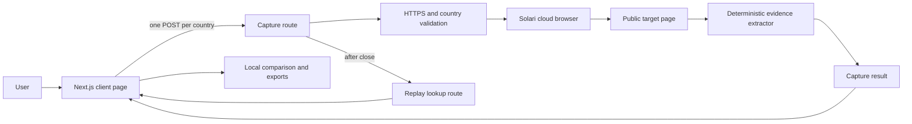
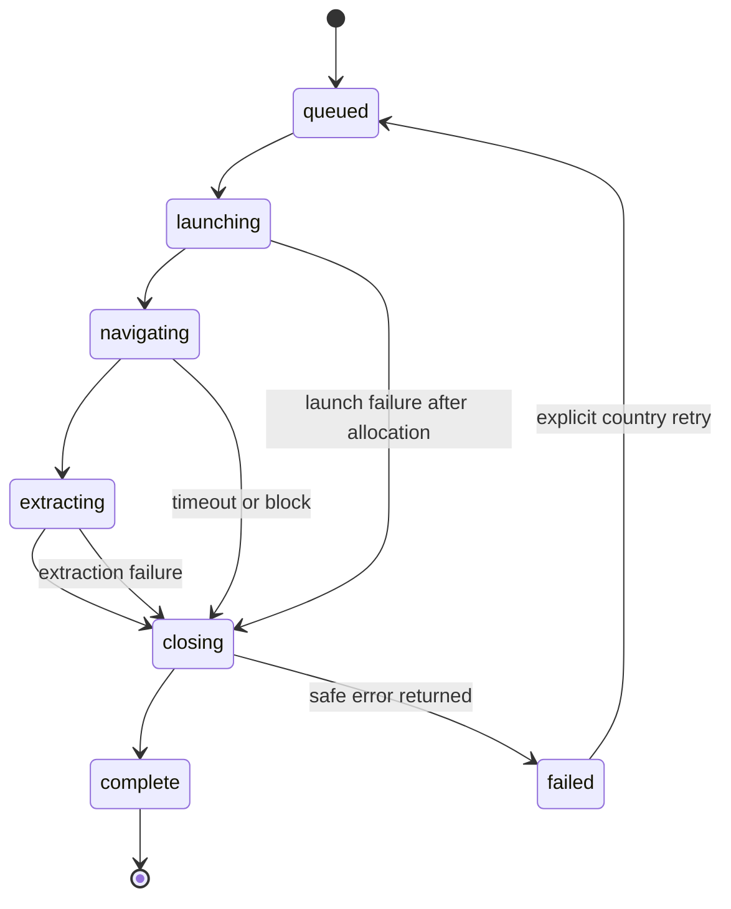

# LocaleLens Product and System Design

**Status:** Approved direction; documentation-only baseline

**Date:** 2026-09-01

**Audience:** Product reviewers, implementation agents, and Solari challenge reviewers

**Implementation authority:** None. Phase work begins only from the matching phase plan and stops at that phase's gate.

## 1. Product decision

LocaleLens is a focused web application for product, growth, localization, and QA teams. A user enters one public HTTPS URL, selects two or three supported countries, and receives a side-by-side evidence report showing what the same page actually rendered in each market.

The initial release uses Solari cloud browsers only. It does not use Lunar AI, FrameBase, a desktop VM, a sandbox, an LLM, persistent accounts, a database, background jobs, scheduled monitoring, or autonomous form interaction.

### Product promise

> See what customers in each market actually see before a regional launch.

### Why this is the selected approach

Three approaches were considered:

1. **Regional-experience comparison — selected.** It uses Solari's proxy, parallel browser, screenshot, and recording capabilities directly; it has a clear buyer/user; and it fits a polished, data-heavy React interface.
2. **General UX audit agent — rejected.** It overlaps current Solari challenge submissions and adds subjective model output, code mutation, and a larger trust surface.
3. **Job-research agent — rejected.** It is personally useful but overlaps existing research-agent submissions and requires an additional model provider to be compelling.

## 2. Target user and job

### Primary user

A product designer, growth manager, localization lead, or QA engineer preparing or reviewing a public web launch across markets.

### Core job

> When I am checking a public page before a regional launch, I want one trustworthy comparison of what selected markets render, so I can identify unexpected redirects, copy, currency, consent, or availability differences without manually operating multiple VPNs and browsers.

### MVP success criteria

A first-time user can:

1. Enter one public HTTPS URL.
2. Select two or three countries from the supported set.
3. Start one bounded comparison run.
4. See independent progress and failure states for every country.
5. Inspect screenshots and normalized evidence side by side.
6. See which fields match, differ, or are unavailable.
7. Open a temporary Solari replay when it is ready.
8. Download a redacted JSON report and a self-contained HTML report.
9. Understand when a result is incomplete or not proven.

### Submission success criteria

- The public repository is a fork of `solari-sdk/solari-cookbook`.
- The example runs against the real Solari API with the API key held server-side.
- At least one bounded real-provider evidence run is recorded without exposing credentials or session-control material.
- Every launched browser is closed and every Solari client is closed in a `finally` path.
- The UI is usable at 360x800, 768x1024, and 1440x900.
- Unit, component, route, build, and focused end-to-end checks pass.
- The README explains the problem, architecture, setup, safety boundary, evidence, and limitations.
- The repository contains no secret, generated dependency directory, user data, or unrelated project code.

## 3. Scope

### Included

- One-page responsive web application.
- One public HTTPS page per run.
- Two or three countries per run.
- Initial supported countries: United States (`us`), United Kingdom (`gb`), Germany (`de`), France (`fr`), Japan (`jp`), and Australia (`au`).
- Solari browser launch with `stealth: true`, residential country proxy, and `recording: true`.
- Proxy receipt from `browser.proxy`; a successful HTTP response without proxy metadata is not accepted as regional proof.
- Rendered screenshot, final URL, document language, page title, primary heading, CTA labels, detected currency tokens, consent text, load status, capture timestamps, and replay status.
- Deterministic comparison of normalized fields.
- Retry of one failed country only after an explicit user action.
- JSON and escaped self-contained HTML exports.
- A committed redacted sample report for the public static demo state.

### Excluded

- Authenticated sites, login profiles, passwords, payments, checkout, or submitted forms.
- Captcha solving.
- Crawling additional pages or following arbitrary links.
- Legal, compliance, accessibility, or localization certification.
- Claims that absence of detected text proves absence of a feature.
- LLM summaries, rankings, scores, or recommendations.
- User accounts, teams, billing, analytics, database storage, queues, cron jobs, or monitoring.
- Mobile-device emulation and cross-browser matrices.
- Solari sandboxes or desktops.
- Automated posting to X, LinkedIn, GitHub, or Discord.
- Reuse or publication of Lunar AI, FrameBase, Quiet Faith, or any other private codebase.

## 4. Product principles

1. **Evidence before interpretation.** Show the screenshot and captured fields before highlighting a difference.
2. **Partial truth is visible.** One failed country does not erase successful countries or become a complete report.
3. **No invented confidence.** Use `match`, `different`, and `unavailable`; do not create a synthetic quality score.
4. **One task, one page.** The main flow stays on one route and one dominant comparison surface.
5. **Spend is bounded.** At most three browser sessions are launched per user action; retries are explicit and per-country.
6. **Secrets stay server-side.** The browser never receives the Solari API key.
7. **Reviewability is a feature.** Prefer direct functions, discriminated unions, and small modules over framework layers or generic abstractions.

## 5. Experience design

### Visual direction

The product should feel like a precise editorial comparison instrument, not a generic admin dashboard.

- Light theme only for the challenge release.
- Warm neutral canvas, graphite text, fine neutral rules, and one restrained signal color.
- Screenshots are the dominant visual material.
- Country identity uses flags only as secondary decoration; country code and name remain visible text.
- Dense evidence uses aligned rows and quiet dividers, not nested cards.
- Typography uses one sans family already available through the selected Product Design template; no additional webfont request is required for MVP.
- Motion is limited to progress transitions and respects `prefers-reduced-motion`.
- Lucide provides interface icons. No custom SVG icon set is created.

Before Phase 1 implementation, Product Design must generate exactly three visual directions from this brief. The owner selects one target. No UI source files are written before that selection.

### Page composition

1. **Header:** product name, one-sentence promise, and a compact “How it works” disclosure.
2. **Run control:** HTTPS URL field, country multi-select limited to three, and one primary `Compare markets` action.
3. **Run receipt:** target host, start time, selected countries, capture mode, and explicit live/sample label.
4. **Country progress rail:** one semantic status per country: `queued`, `launching`, `navigating`, `extracting`, `closing`, `complete`, or `failed`.
5. **Screenshot comparison:** equal-width regional screenshots at wide widths; horizontally adjacent pairs become a vertical stack below 768px.
6. **Difference table:** field name, one value per country, and a textual comparison result.
7. **Evidence actions:** per-country replay action, per-country retry on failure, JSON download, and print action.
8. **Limitations footer:** public pages only, evidence timestamp, replay expiry, and “not a compliance verdict.”

### Interaction rules

- The URL field is always labeled and uses `inputMode="url"`.
- Two countries are selected by default: `us` and `gb`; a third is optional.
- More than three selected countries is prevented rather than accepted and later rejected.
- Submitting invalid input moves focus to one `role="alert"` error summary.
- Starting a run disables only inputs that would mutate that run; completed evidence remains readable.
- Country results appear as each request settles. The UI does not wait for all countries before showing the first result.
- A failed country shows the exact safe error category and a `Retry country` action.
- Export is disabled until at least one country completes.
- Essential evidence is available without hover.
- Dynamic run status uses one `aria-live="polite"` region; individual animation frames are not announced.

### Responsive contract

- **360x800:** one-column form, stacked country states, one screenshot per row, difference table in a bounded horizontal overflow region only when columns cannot reflow.
- **768x1024:** compact two-column results where readable; form controls wrap without clipping.
- **1440x900:** three equal regional columns with aligned screenshot and evidence rows.
- Minimum touch target is 44x44 CSS pixels for coarse pointers.
- No fixed-height application shell, internal page scroll trap, or essential hover interaction.

## 6. Technical architecture

### Stack

- Node.js `22.20.0`, with package engines restricted to supported Node 22 releases.
- npm with a committed lockfile.
- Next.js `16.3.4` App Router and React `19.2.8`.
- TypeScript `5.9.3` with `strict: true`.
- Tailwind CSS `4.3.3` for layout and tokens.
- Lucide React `1.38.0` for icons.
- Zod `4.5.4` for request and result validation.
- Solari Browser SDK `0.1.2`.
- Vitest `4.1.11` and React Testing Library for unit/component tests.
- Playwright Test `1.62.1` for focused browser tests.
- No state-management, animation, charting, component-suite, database, telemetry, or HTTP-client dependency.

Versions are the verified registry versions on 2026-09-01. Phase 0 records the installed resolution and stops if a required package is unavailable or its documented API no longer matches the plan.

### Runtime shape



Each selected country is an independent HTTP request. This removes the need for a job store, queue, WebSocket, server-sent events, or cross-request coordinator. The client owns only transient presentation state.

### Planned source map

```text
examples/localelens-web/
├── app/
│   ├── api/captures/route.ts        # one regional capture request
│   ├── api/replays/[id]/route.ts    # temporary replay URL lookup
│   ├── globals.css                  # selected visual tokens and base styles
│   ├── layout.tsx                   # metadata and document shell
│   └── page.tsx                     # one-page product composition
├── src/features/compare/
│   ├── compare-evidence.ts          # deterministic field comparison
│   └── compare-evidence.test.ts
├── src/features/export/
│   ├── create-json-report.ts        # bounded deterministic JSON
│   └── create-json-report.test.ts
├── src/features/capture/
│   ├── capture-region.ts            # Solari lifecycle owner
│   ├── capture-region.test.ts
│   ├── contracts.ts                 # schemas and domain types
│   ├── extract-page-evidence.ts     # browser-page extraction
│   ├── extract-page-evidence.test.ts
│   ├── safe-error.ts                # allowlisted public errors
│   ├── validate-public-url.ts       # HTTPS and public-target validation
│   └── validate-public-url.test.ts
├── src/features/run/
│   ├── run-comparison.ts            # client orchestration, max three requests
│   ├── run-comparison.test.ts
│   ├── use-comparison-run.ts        # small reducer-backed hook
│   └── use-comparison-run.test.tsx
├── src/components/
│   ├── audit-form.tsx
│   ├── comparison-results.tsx
│   ├── difference-table.tsx
│   ├── region-result.tsx
│   ├── run-receipt.tsx
│   └── run-status.tsx
├── src/test/
│   ├── fixtures.ts                  # deterministic sample evidence
│   └── setup.ts
├── e2e/
│   ├── accessibility.spec.ts
│   ├── comparison.spec.ts
│   └── responsive.spec.ts
├── public/sample/
│   ├── report.json                  # redacted committed example
│   └── us.jpg gb.jpg de.jpg         # redacted evidence screenshots
├── .env.example
├── package.json
├── package-lock.json
├── next.config.ts
├── tsconfig.json
└── README.md
```

No `lib`, `utils`, `services`, `stores`, or `types` catch-all directory is created. A shared module is introduced only when two real callers need the same behavior.

## 7. Contracts

### Request

```ts
type SupportedCountry = "us" | "gb" | "de" | "fr" | "jp" | "au"

type CaptureRequest = {
  url: string
  country: SupportedCountry
}
```

### Result

```ts
type CaptureStage =
  | "queued"
  | "launching"
  | "navigating"
  | "extracting"
  | "closing"
  | "complete"
  | "failed"

type PageEvidence = {
  requestedUrl: string
  finalUrl: string
  title: string | null
  documentLanguage: string | null
  primaryHeading: string | null
  primaryAction: string | null
  ctas: string[]
  currencies: string[]
  priceSnippets: string[]
  consentText: string | null
  httpStatus: number | null
  capturedAt: string
}

type CaptureReceipt = {
  country: SupportedCountry
  proxyCountry: SupportedCountry
  proxyTier: "residential"
  timezoneId: string | null
  sessionId: string
  recordingRequested: true
}

type CaptureSuccess = {
  ok: true
  evidence: PageEvidence
  receipt: CaptureReceipt
  screenshot: {
    mediaType: "image/jpeg"
    base64: string
    width: number
  }
}

type SafeCaptureErrorCode =
  | "INVALID_INPUT"
  | "UNSUPPORTED_COUNTRY"
  | "PRIVATE_TARGET_BLOCKED"
  | "NAVIGATION_TIMEOUT"
  | "TARGET_BLOCKED"
  | "SOLARI_CAPACITY"
  | "SOLARI_AUTH"
  | "SOLARI_PROXY_MISMATCH"
  | "CAPTURE_FAILED"

type CaptureFailure = {
  ok: false
  error: {
    code: SafeCaptureErrorCode
    message: string
    retryable: boolean
  }
}

type CaptureResponse = CaptureSuccess | CaptureFailure
```

### Comparison

```ts
type ComparisonState = "match" | "different" | "unavailable"

type ComparedField = {
  field:
    | "finalUrl"
    | "title"
    | "documentLanguage"
    | "primaryHeading"
    | "primaryAction"
    | "ctas"
    | "currencies"
    | "priceSnippets"
    | "consentText"
  state: ComparisonState
  values: Partial<Record<SupportedCountry, string[]>>
}
```

Normalization trims whitespace, collapses internal whitespace, lowercases only for equality comparison, removes duplicate array entries, and preserves original values for display. It does not translate, classify sentiment, or infer meaning.

## 8. Capture lifecycle



The lifecycle owner creates one `Solari` client and one browser. `browser.close()` and `solari.close()` run in nested `finally` cleanup. Cleanup errors are recorded server-side with the session ID redacted and never replace the primary safe client error.

## 9. Page evidence rules

- Navigate with `waitUntil: "domcontentloaded"` and a 30-second navigation timeout.
- Wait at most two additional seconds for first-render settling; do not wait for `networkidle` on pages with perpetual requests.
- Do not click, type, accept consent, solve captchas, scroll, or follow links.
- Capture a full-page JPEG at quality 72 and viewport width 1280.
- Read only rendered text and attributes needed by `PageEvidence`.
- CTA candidates are visible `button`, role-button, and anchor labels, trimmed and capped at 20 entries of 120 characters each.
- Currency detection recognizes visible ISO codes and common currency symbols, deduplicated and capped at 12 entries.
- Price snippets preserve visible surrounding price text, deduplicated and capped at 8 entries of 160 characters.
- Consent detection reports the first visible text block containing an allowlisted consent/cookie term, capped at 500 characters. `null` means “not detected,” not “absent.”
- Any extracted string is treated as untrusted data. It is rendered as text, never HTML.
- The screenshot and raw base64 are excluded from logs.

## 10. Security and privacy

### Threats and controls

| Threat | Control |
|---|---|
| Solari key exposure | Server-only environment variable; no `NEXT_PUBLIC_` alias; schema and tests reject it from responses. |
| SSRF-like target abuse | HTTPS only; no credentials; default port only; reject localhost, `.local`, IP literals in non-public ranges, and DNS answers in private/reserved ranges; validate final URL before accepting evidence. |
| Redirect into unsafe destination | Abort and return `PRIVATE_TARGET_BLOCKED` when final URL violates the same public-target policy; never present it as successful evidence. |
| Unbounded spend | Two or three selected countries; one session per country; no automatic capture retry; explicit retry of one failed country; hard request timeout. |
| Session-control leakage | Session ID excluded from logs and public exports; replay URLs are requested only through the server and described as temporary sensitive links. |
| Prompt or evidence injection | No model consumes page text; rendered page data is escaped and treated as data. |
| Stored personal data | No database or server persistence; client memory is cleared on reload; committed sample data is reviewed and redacted. |
| Public endpoint abuse | Public hosted challenge demo uses sample mode. Live capture is enabled only in an owner-controlled environment with `LIVE_CAPTURE_ENABLED=true`. |
| HTML report injection | Escape `&`, `<`, `>`, `"`, and `'`; never interpolate unescaped page content into markup or script. |

### Environment variables

```text
SOLARI_API_KEY=required-for-live-mode
LIVE_CAPTURE_ENABLED=false
```

`LIVE_CAPTURE_ENABLED` is a necessary safety boundary, not general configuration. The public deployment defaults to the committed sample report. A reviewer can run live mode locally with their own Solari key.

## 11. Error policy

The server logs a structured internal category and a randomly generated request ID. It never logs the API key, session ID, replay URL, screenshot, full page text, or upstream response body.

The client receives only allowlisted error codes and plain messages. Unknown exceptions become `CAPTURE_FAILED`. An unsuccessful or mismatched proxy receipt never becomes a regional result.

Partial results remain visible and exportable with an explicit `partial` report status.

## 12. Testing and evidence

### Automated layers

1. **Unit:** URL validation, normalization, comparison, error mapping, and export escaping.
2. **Component:** keyboard operation, field errors, selection limit, independent progress, partial failure, retry, and export availability.
3. **Route:** schema rejection, live-mode guard, safe errors, cleanup calls, and absence of secret/session fields.
4. **Sample-mode E2E:** complete main journey with committed deterministic evidence.
5. **Live-provider E2E:** separately authorized, bounded to three sessions for one run plus at most one failed-country retry.

### Verification commands

```bash
npm test
npm run typecheck
npm run lint
npm run build
npm run test:e2e:sample
```

The live command is separate so normal checks cannot spend credits:

```bash
LIVE_CAPTURE_ENABLED=true npm run test:e2e:live
```

### Evidence vocabulary

- `PASS`: the named automated or observed check passed in the named environment.
- `FAIL`: the named check ran and failed.
- `NOT_PROVEN`: the check did not run or the evidence does not support the claim.
- `PARTIAL`: at least one country completed and at least one did not.

Local sample, local live-provider, hosted sample, hosted live-provider, manual Browser inspection, assistive-technology, and production evidence remain separate rows.

## 13. Performance and dependency budget

- First-party client JavaScript target: under 180 kB gzip for the main route, measured from the production build output.
- Initial page has no screenshot payload until the sample or live result is requested.
- A screenshot JPEG is capped at 1.5 MB before base64 encoding; larger captures fail safely rather than consuming unbounded memory.
- A capture response is capped at 3 MB.
- No dependency is added for behavior expressible clearly in fewer than roughly 40 tested lines of local code.
- No global state library, animation library, UI component suite, date library, request client, or utility bundle.
- Imports use exact modules and remain tree-shakeable.

## 14. Accessibility

- Semantic headings and landmarks.
- Visible labels for every form field and action.
- Native controls before custom controls.
- Keyboard-reachable country selection and actions.
- Visible focus styles.
- No information communicated by color alone.
- One polite live region for run status and one alert region for actionable errors.
- Screenshots include country, URL host, and timestamp in alternative text; extracted evidence remains the text alternative to visual comparison.
- Reduced-motion support.
- 200% browser zoom must preserve reachability; direct screen-reader output remains `NOT_PROVEN` until separately observed.

## 15. Delivery phases

| Phase | Deliverable | Live Solari calls | Stop gate |
|---|---|---:|---|
| 0 | Fork-aligned repository foundation, contracts, deterministic tests, docs | 0 | Foundation checks pass; no UI or SDK call |
| 1 | Selected visual direction and complete sample-mode responsive shell | 0 | Owner accepts visual/browser evidence |
| 2 | Secure one-country Solari capture and replay core | Max 3 evidence calls | Cleanup, proxy receipt, and route tests pass |
| 3 | Parallel multi-country comparison, retry, and exports | Max 4 evidence calls | Main journey passes with partial-failure behavior |
| 4 | Hardening, accessibility, performance, and final evidence register | Max 4 evidence calls | All required gates pass or remain explicitly not proven |
| 5 | Public repository package, static hosted sample, demo, and submission copy | 0 by default | Owner approves before push, deploy, or social post |

Each phase has a standalone implementation plan in `docs/superpowers/plans/`. A completed phase does not authorize the next phase.

## 16. Public launch boundary

The public repository reveals LocaleLens only when the owner creates the fork and authorizes publication. Until then:

- Do not comment the product concept on X.
- Do not create a public GitHub repository, issue, pull request, Discord message, or deployment.
- Do not expose the Solari API key or live session material.
- The public challenge comment, if any, stays generic.

The public deployment is sample mode by default. The recorded demo and evidence register may show a real run only after manual redaction review.

## 17. Sources

- Solari cookbook: <https://github.com/solari-sdk/solari-cookbook/>
- Solari overview: <https://docs.getsolari.com/>
- Solari proxy behavior: <https://docs.getsolari.com/proxies>
- Solari recording behavior: <https://docs.getsolari.com/recording>
- Solari pricing: <https://docs.getsolari.com/pricing>
- Challenge fact sheet: <https://x.com/harrychow_/status/2094521275586691410>
- Market-need reference: <https://www.browserstack.com/docs/ip-geolocation>

## 18. Resolved decisions

- Working name: LocaleLens.
- Public target: a fork of the cookbook, not a blank standalone repository.
- Framework: Next.js App Router.
- UI tooling: Tailwind CSS and Lucide only for MVP.
- Theme: light only.
- Data persistence: none.
- Live-hosting policy: sample mode publicly; owner-controlled live mode locally.
- Provider scope: Solari browser only.
- Model scope: no LLM.
- Submission surface: public source, redacted real evidence, short demo video, and owner-authored social post.
