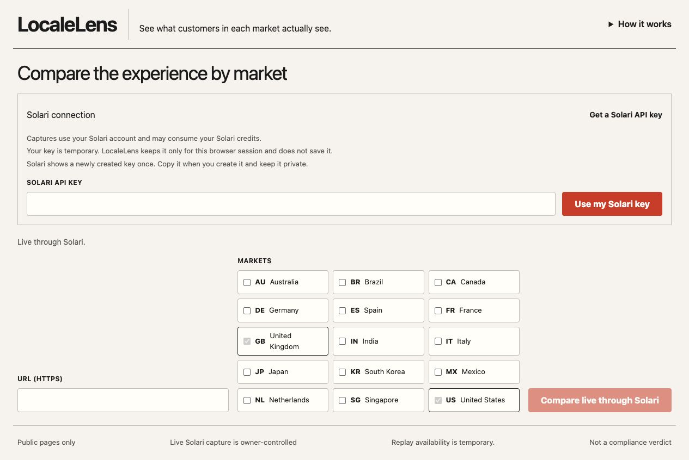
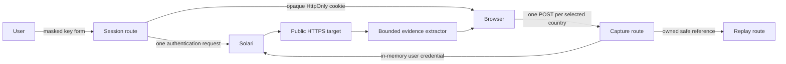

# LocaleLens

LocaleLens compares one public HTTPS page across selected markets using live,
reviewable Solari browser evidence. Every user supplies their own Solari API key
through the visible masked connection form. LocaleLens has no shipped sample
mode and no server-owned credential fallback.

Built for product designers, localization teams, and QA engineers checking
whether customers see different language, pricing, calls to action, redirects,
or consent messaging by market. Solari supplies the regional browser sessions;
LocaleLens turns their captured page facts into a reviewable comparison.



Current production-build interface, captured without credentials or provider calls.

## What you can do

- Compare 2–15 markets, with at most three captures running concurrently.
- Follow per-market progress and keep successful evidence when another market fails.
- Expand a screenshot for a larger view and compare extracted fields side by side.
- Download a bounded JSON report or print the evidence (including Save as PDF
  through your browser's print dialog).
- Optionally open **Technical details → View page-load recording**. This shows
  how the captured page loaded; it does not click, scroll, or navigate the site.
  Recording availability is checked only after opening Technical details.

This is deterministic evidence comparison, with no LLM-generated assessment.
Differences are signals for review, not a compliance verdict or proof that
geography alone caused a change. No difference is also a valid result.

For the application materials, see the [reviewer handoff](docs/submission/reviewer-handoff.md)
and [project summary](docs/submission/project-summary.md).

## Run locally

Prerequisites: Git, Node `v22.22.2`, and your own Solari account/key with access
to regional browser proxies and sufficient credits. If you use nvm:

```sh
git clone https://github.com/Billy-I/solari-cookbook.git
cd solari-cookbook/examples/localelens-web
nvm install 22.22.2
nvm use 22.22.2
npm ci
npm run dev -- --hostname 127.0.0.1 --port 34126
```

Open <http://127.0.0.1:34126/>. Keep that terminal running. All npm commands in
this guide run from `solari-cookbook/examples/localelens-web`, where the app's
`package.json` lives, not from the cookbook root or a separate planning folder.

If you already have the repository, skip cloning and change into that app
directory. No `.env` file, database, or second service is required. A browser
download for Playwright is needed only for automated tests, not normal app use.

Obtain a key from
<https://console.getsolari.com/>. Solari displays a newly created key once, so
copy it when it is created and keep it private. Enter it only in LocaleLens's
visible password field, then press **Use my Solari key**. Never put a key in
chat, source, a file, a URL, a screenshot, an environment variable, or browser
developer tools.

### First comparison

1. Connect with **Use my Solari key** and wait for **Ready for this session**.
2. Enter a public HTTPS URL. `https://example.com/` is a basic connectivity
   check; use a public page you want to evaluate for meaningful regional evidence.
3. Check the selected markets carefully. GB and US are selected initially;
   those two markets mean exactly two initial capture requests.
4. Press **Compare live through Solari** once when you accept that credit use.
5. Review **What changed**, expand **Screenshots and regional evidence**, and
   use **View larger** on a country card. Open **Detailed field comparison**
   for the individual values, then download JSON or print if needed.
6. A pending recording does not block the screenshots or report. Check it
   manually under Technical details only if you need to examine the page load.
7. Press **Disconnect**, then use Ctrl+C in the terminal when finished.

### Troubleshooting

- `ENOENT` / missing `package.json`: change into `examples/localelens-web`
  inside the cloned repository before running npm.
- `EADDRINUSE`: a server already uses the selected port. Use your existing
  server, stop it in its own terminal, or choose a different local port.
- Compare is disabled: connect first. A restart or expired credential session
  requires reconnecting through the masked field.
- Authentication or capture fails: read the visible error and check your
  account access/credits privately. Failures do not silently retry or fall back
  to sample results. A manual capture retry may use additional credits.
- Recording is pending/unavailable: continue with the completed screenshot and
  field evidence. **Download NDJSON** is optional developer event data, opened
  with a text editor; it is not a video or an archive to expand.

For a local production build, stop the dev server first, then run `npm run build`
and `npm run start -- --hostname 127.0.0.1 --port 34126` from the same directory.

## Connection lifecycle

The connect action makes one non-capture authentication request to Solari. On
success, LocaleLens clears the field and shows **Ready for this session**. The
raw key exists only in server-process memory behind a random HttpOnly,
SameSite=Strict session cookie; the cookie contains an opaque token, not the
key. The key is not written to local storage, session storage, IndexedDB, the
Cache API, analytics, telemetry, logs, exports, or committed evidence.

Credential sessions expire after 30 minutes without use or eight hours
absolutely. A server restart forgets every session. Browser restore may retain
an opaque session cookie while the restarted server has no matching key; the
next status check then returns to the disconnected state. **Disconnect**
deletes the credential session and every replay/capture reference owned by it,
then clears the cookie. Closing the exact server process also destroys all
in-memory keys.

This implementation supports one application process. Multi-instance hosting
would require a separately designed shared secret store and is not claimed.
Production use requires HTTPS so the session cookie can be Secure. Localhost is
the supported development exception.

## Capture and credit boundary

Enter one public HTTPS target and select two to fifteen markets. Pressing
**Compare live through Solari** creates exactly one initial Solari browser
capture per selected country and may consume one unit of the user's Solari
credits per country. Authentication does not authorize a capture. LocaleLens
batches at most three captures concurrently and never retries automatically.
Each visible **Retry** action creates one additional capture and therefore
requires a separate spend decision.

`SOLARI_CAPTURE_DISABLED=true` is a server-side emergency disable-only switch.
It cannot enable capture, provide a key, or select a mode. Normal operation does
not require credential or mode environment variables.

## Recognize real results

A run begins only after the visible compare action and receives an `llr_`
application run ID. Successful country cards say **Live evidence** and show the
requested/final URL, capture time, bounded screenshot, normalized evidence,
proxy-country receipt, and an app-owned `sol_` correlation reference when one
is available. Reports use schema version 3 and
`"provenance": "live_solari"`. There is no fixture fallback.

Failures remain failures. Safe UI categories include invalid authentication,
temporary authentication or provider unavailability, capacity, timeout,
proxy-country mismatch, invalid target/response, and generic capture failure.
Provider bodies, raw provider session IDs, credentials, cookies, and request
headers are not shown. Partial evidence remains reviewable when at least two
countries succeed.

## Safe stopping

Before a live run, record the exact public URL, selected country names/codes,
and initial capture count. Press compare once only after approving that count.
Do not press retry without approving the additional call. When finished, press
**Disconnect**, stop the exact terminal-owned server process, and verify its
literal port has no listener before starting another server. Do not use broad
process termination commands.

## Architecture and boundaries



Targets reject credentials, fragments, non-default ports, local/private hosts,
and unsafe DNS results. Capture and replay requests require the opaque local
session, custom request header, same-origin checks, bounded bodies, and strict
response contracts. Session ownership prevents one connected browser from
reading another browser's run references.

Historical sample artifacts remain only in archived documentation and governed
evidence. Current unit tests use test-only factories, and Playwright installs a
browser-route double exclusively under `e2e/`; neither is imported by production
source or emitted into the production bundle.

## Verification

Run the credential-free gate from this directory. Install the test browser once
with `npx playwright install chromium`. These tests use synthetic provider
responses and require no real Solari key:

```sh
node --version
npm test
npm run typecheck
npm run lint
SOLARI_API_KEY=synthetic-secret-build-canary npm run build
npm run check:budget
npm run check:api-methods
npm run check:production-boundaries
npm run test:e2e
```

The synthetic build canary is deliberately not a usable key. The build and
boundary checks prove that even this sentinel cannot become a runtime fallback
or leak into client/static or rendered server output. Playwright evidence uses
only synthetic `.test` responses and does not prove the live Solari provider,
dashboard, hosted deployment, or direct assistive-technology behavior.

See [manual acceptance](docs/evidence/live-product-readiness/manual-acceptance.md)
and the [BYOK live-only evidence report](docs/evidence/byok-live-only.md).
The [current handoff verification](docs/evidence/submission-handoff-2026-09-06.md)
records the latest local gate; older phase reports describe their historical
versions and do not re-enable sample mode.
