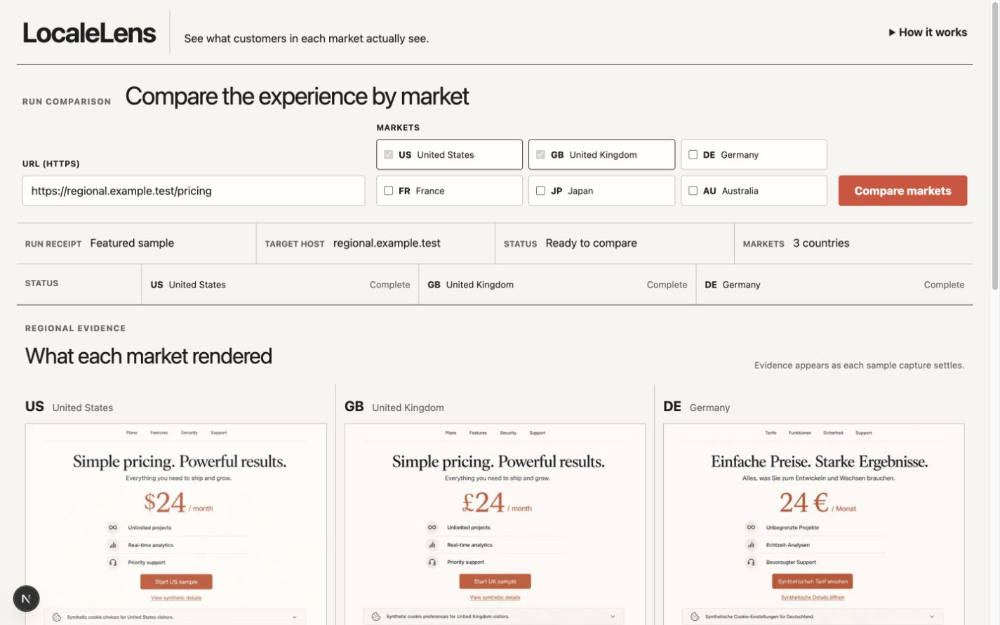
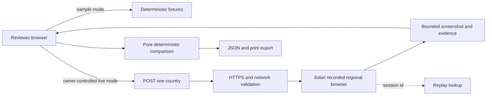

# LocaleLens

LocaleLens helps product designers, growth teams, localization leads, and QA
engineers compare how one public HTTPS page renders across selected markets,
using reviewable evidence rather than an assumed VPN location.



## Reviewer journey

Start in deterministic sample mode: install dependencies, run the app, and
compare the featured public-page fixture without a Solari key or provider call.
The interface shows a run receipt, country progress, screenshots, normalized
evidence differences, redacted JSON export, print output, and replay state.

Solari is essential only for local owner-controlled live mode. It launches one
recorded regional browser per selected country through a residential proxy,
checks the matching proxy-country receipt, captures bounded page evidence, and
allows an explicit replay lookup. Tests, evidence, and the limits of each
evidence class are linked below; sample checks do not prove provider, hosted,
or assistive-technology behavior.

## What is shipped

- One public HTTPS target, compared across two or three supported countries.
- Deterministic sample results with no capture or replay API request.
- Independent country progress, partial results, and one explicit failed-country retry.
- Bounded screenshots and normalized URL, language, title, heading, CTA,
  currency, consent, status, and timestamp evidence.
- Side-by-side screenshots, difference states, redacted JSON export, print,
  and safe replay pending, ready, or unavailable presentation.

## Provenance and mode boundary

Sample mode is deterministic local fixture evidence. It is the normal local
and public-safe mode and uses `NEXT_PUBLIC_APP_MODE=sample` with
`LIVE_CAPTURE_ENABLED=false`. It spends zero Solari credits.

Live mode is local and owner-controlled. It requires
`LIVE_CAPTURE_ENABLED=true` and the server-only `SOLARI_API_KEY`; never place
the key in client code, a `NEXT_PUBLIC_` variable, committed files, logs,
screenshots, or documentation. A live run uses Solari Browser with stealth,
residential proxy egress, recording, receipt validation, bounded extraction,
and an explicit replay lookup. No automatic capture retry occurs.

## Architecture



Each live country request is separately validated, captured, and closed. The
client merges results in stable country order; replay lookup is a separate,
explicit action. There is no account system, database, queue, background
worker, analytics pipeline, or model provider.

## Local setup

From the cookbook root, use Node `v22.22.2`:

```bash
cd examples/localelens-web
nvm use
node --version
npm install
npm run dev
```

Open the local URL printed by Next.js and use sample mode. For an authorized
local live proof only, load the server-only `SOLARI_API_KEY` from a local secret
path and set `LIVE_CAPTURE_ENABLED=true`. Keep live mode disabled for normal
development and any public-safe sample deployment.

## Verification and evidence

Run non-live checks from `examples/localelens-web/`:

```bash
npm test
npm run typecheck
npm run lint
NEXT_PUBLIC_APP_MODE=sample npm run build
npm run check:budget
npm run test:e2e
npm run check:api-methods
npm ls --depth=0
```

The accepted Phase 4 local gate passed 23 Vitest files / 234 tests, sample
build, budget, and 11/11 sample Playwright tests with zero capture/replay API
requests. Its bounded live evidence used exactly four captures for Spotify
Premium: US, GB, DE, and one explicit GB retry; six replay lookups were
recorded separately. See the [execution index](../../docs/EXECUTION_INDEX.md),
[Phase 4 evidence](docs/evidence/phase-4.md), [security review](docs/evidence/security-review.md),
[visual review](docs/evidence/visual-review.md), and [approved design](../../docs/superpowers/specs/2026-09-01-localelens-design.md).

## Security, privacy, and limitations

Only server routes access `SOLARI_API_KEY` at request time. Targets must be
public HTTPS addresses and pass hostname and DNS-address validation; credentials,
fragments, non-default ports, local hosts, and private or reserved addresses are
rejected. Screenshots, session IDs, replay URLs, raw page text, provider bodies,
and environment values are excluded from logs and committed evidence.

This is qualified local evidence, not a production claim. Hosted or deployed
behavior, direct screen-reader or VoiceOver output, actual browser-chrome 200%
zoom, Browser reduced motion, live-only mobile and tablet transient states, raw
provider receipts or tier data, provider-console cleanup, and the application
method contract for `TRACE` remain `NOT PROVEN` as detailed in Phase 4 evidence.

## Phase boundary

Phase 4 is owner accepted at `ec05f42bfadce32a406ffd1e883c03582aacfb90`.
Phase 5 Tasks 1–3 are in progress. Task 4, push, deployment, publication,
submission, posting, pull request, and merge remain unauthorized.
